[Задание](https://github.com/netology-code/kuber-homeworks/blob/main/1.1/1.1.md)

### Задание 1. Установка MicroK8S

##### 1. Установить MicroK8S на локальную машину или на удалённую виртуальную машину.
Создаём ВМ на Yandex Cloud.
Добавляем пользователя

```bash
sudo snap install microk8s --classic
sudo usermod -a -G microk8s $USER
sudo chown -f -R $USER ~/.kube.
```
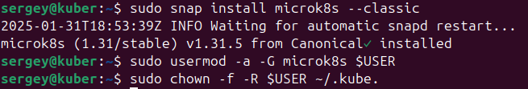

Проверяем статус:
```bash
microk8s status
```
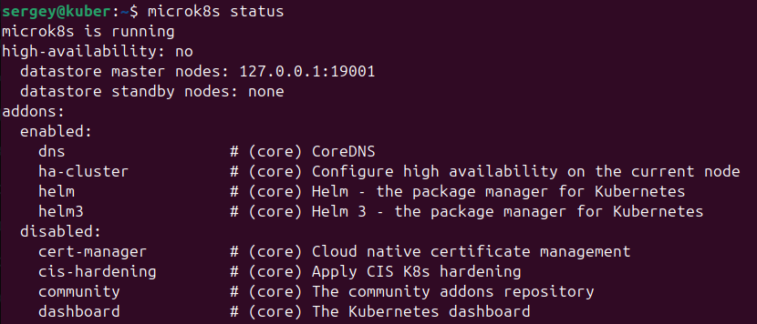

##### 2. Установить dashboard.
```bash
microk8s enable dashboard
```
Проверяем статус:
```bash
microk8s status
```
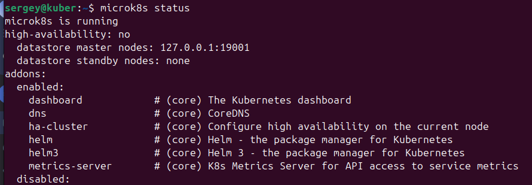

##### 3. Сгенерировать сертификат для подключения к внешнему ip-адресу.
Для начала добавить внешний адрес в template:
`/var/snap/microk8s/current/certs/csr.conf.template`

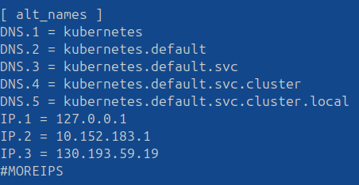

```bash
mkdir ~/certs && cd ~/certs

# Создание приватного ключа
openssl genrsa -out dashboard.key 2048

# Создание запроса на сертификат (CSR)
openssl req -new -key dashboard.key -out dashboard.csr -subj "/CN=130.193.59.19"

# Создание самоподписанного сертификата
openssl x509 -req -in dashboard.csr -signkey dashboard.key -out dashboard.crt -days 365

```

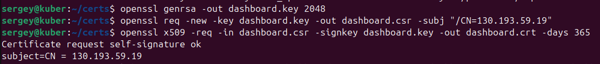

##### Копируем сертификат на своё место
```bash
scp sergey@130.193.59.19:~/certs/dashboard.crt ./dashboard.crt
scp sergey@130.193.59.19:~/certs/dashboard.key ./dashboard.key
```
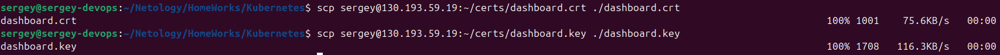

## Задание 2. Установка и настройка локального kubectl
##### 1 Установка kubectl на локальной машине
```bash
curl -LO https://storage.googleapis.com/kubernetes-release/release/`curl -s https://storage.googleapis.com/kubernetes-release/release/stable.txt`/bin/linux/amd64/kubect
```
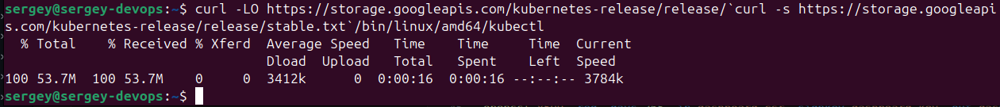

```bash
chmod +x ./kubectl
sudo mv ./kubectl /usr/local/bin/kubectl
source <(kubectl completion bash)
echo "source <(kubectl completion bash)" >> ~/.bashrc
```
Проверяем версию  

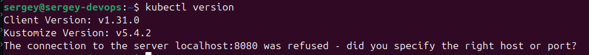

##### 2 Настроить локально подключение к кластеру.
На сервере копируем конфиг micro8k в домашнюю директорию:
```bash
microk8s config > ~/microk8s.config
```
На локальной машине копируем этот же файл:
```bash
scp sergey@130.193.59.19:~/microk8s.config ~/.kube/config
```
В `config` на локальной машине меняем внутренний IP адрес на внешний:  

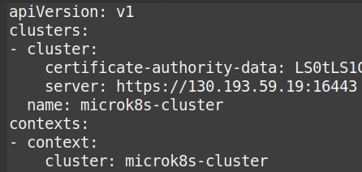

```bash
kubectl create namespace kubernetes-dashboard
```
Проверяем ноды:

```bash
kubectl get nodes
```
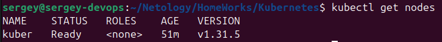

Проверяем pod:
```bash
kubectl get pods -n kube-system -l k8s-app=kubernetes-dashboard
```
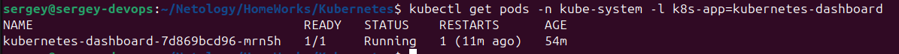

Пробрасываем порт:
```bash
kubectl port-forward -n kube-system pod/kubernetes-dashboard-7d869bcd96-mrn5h 8443:8443
```
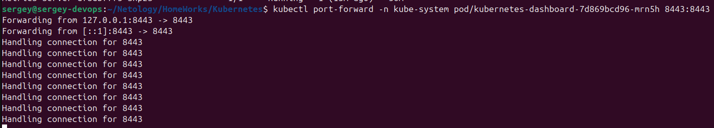

Проверяем в браузере:
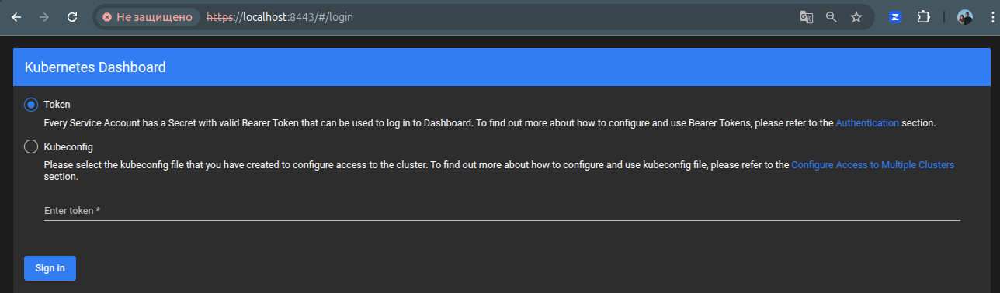