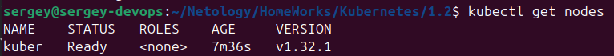
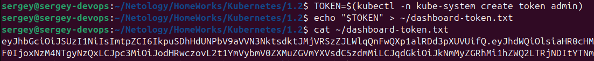
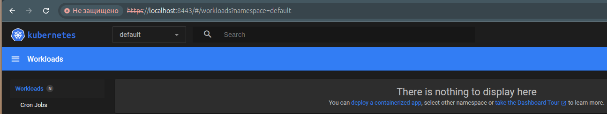
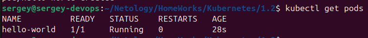
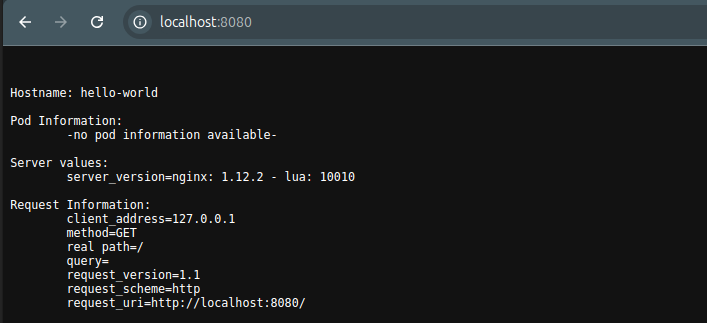
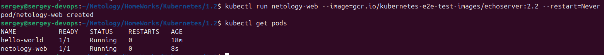
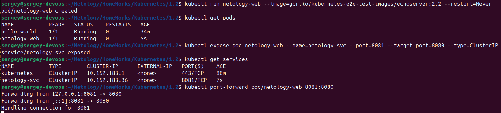
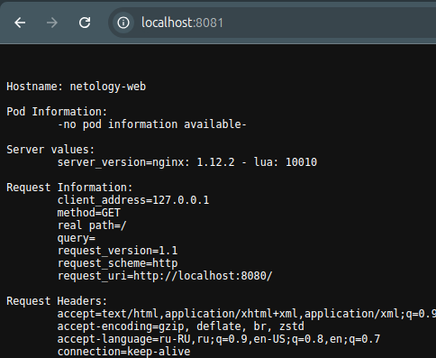
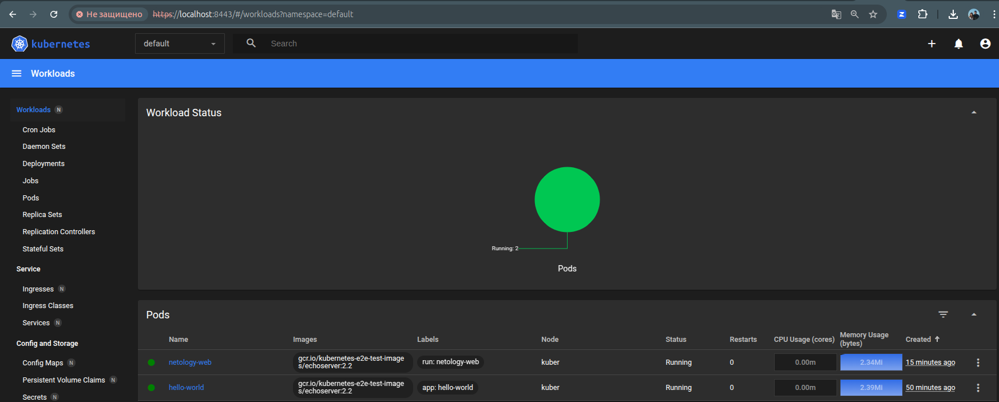

[Задание](https://github.com/netology-code/kuber-homeworks/blob/main/1.2/1.2.md)

## Подготовка
1. Пишем [скрипт](init.sh) установки microk8s, копируем на сервер и запускаем:  
На локальной машине:  
`scp init.sh admin@158.160.138.231:~/`  
На удалённой машине:  
`./init.sh`  

2. Пишем [скрипт](prepare.sh) подготовки microk8s к внешнему подключению:  
На локальной машине:  
`scp prepare.sh admin@158.160.138.231:~/`  
На удалённой машине:  
`./prepare.sh`  

3. Подгружаем на локальную машину конфиг:
`scp admin@158.160.138.231:~/microk8s.config ~/.kube/config`

4. Проверяем ноды:

```bash
kubectl get nodes
```


5. Создаём namespace kubernetes-dashboard:
```bash
kubectl create namespace kubernetes-dashboard
```

6. Создаём сервисный аккаунт администратора:
Пишем [файл конфигурации ServiceAccount.yml](ServiceAccount.yml) и запускаем команду:
```bash
kubectl apply -f ServiceAccount.yml
```

7. Получаем токен для доступа к Dashboard
```bash
TOKEN=$(kubectl -n kube-system create token admin)
echo "$TOKEN" > ~/dashboard-token.txt
```


8. Переадресуем локальный порт на удалённую машину:
```bash
kubectl port-forward -n kube-system pod/kubernetes-dashboard-57bc5f89fb-vbbvh 8443:8443
```

9. Проверяем:
- Открываем в браузере `https://localhost:8443/`
- Вводим полученный токен  


## Задание 1
1. Пишем [`hello-world.yml`](hello-world.yml)

2. Запускаем (локально):
```bash
kubectl apply -f hello-world-pod.yml
```
Проверяем 
```bash
kubectl get pods
```


3. Перенаправляем порт:
```bash
kubectl port-forward pod/hello-world 8080:8080
```
Проверяем


## Задание 2
1. Создаём pod из командной строки и проверяем:
```bash
kubectl run netology-web --image=gcr.io/kubernetes-e2e-test-images/echoserver:2.2 --restart=Never

kubectl get pods
```


2. Создаём сервис:
```bash
kubectl expose pod netology-web --name=netology-svc --port=8081 --target-port=8080 --type=ClusterIP
```

3. Перенаправляем порт
```bash
kubectl port-forward pod/netology-web 8081:8080
```


Проверяем  


Проверяем поды из dashboard (для этого пришлось пересоздать токен)

