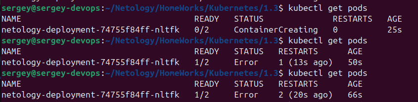
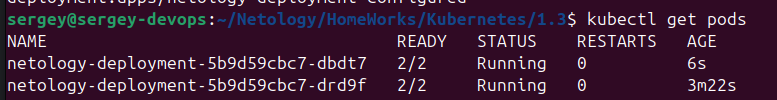
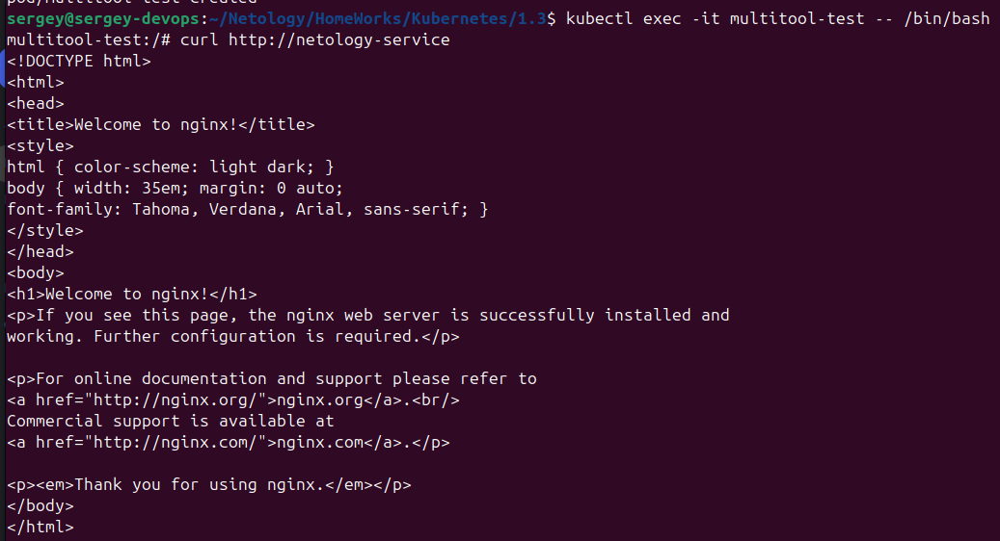
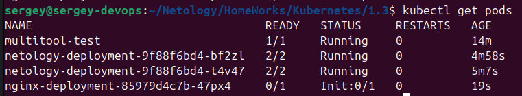
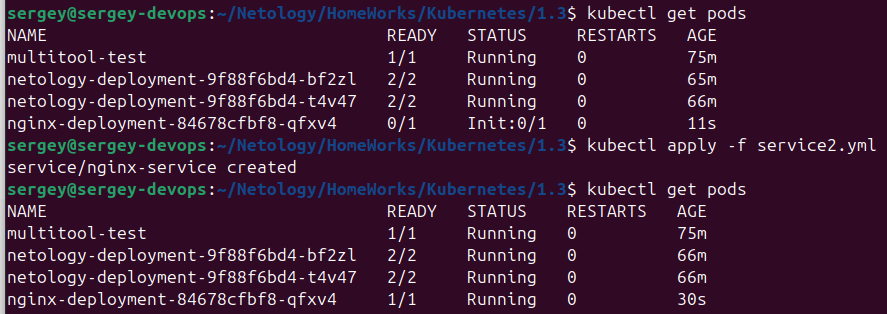

[Задание](https://github.com/netology-code/kuber-homeworks/blob/main/1.3/1.3.md)

## Подготовка
```bash
# Копируем скрипты на сервер
scp init.sh admin@130.193.46.75:~/
scp prepare.sh admin@130.193.46.75:~/
# После запуска скриптов на сервере
scp admin@130.193.46.75:~/microk8s.config ~/.kube/config
```

## Задание 1
- Пишем [deployment.yml](deployment.yml)
- Запускаем  
`kubectl apply -f deployment.yml`

- Проверяем:  
`kubectl get deployments`



Без этой строки контейнер с multitool создаётся с ошибкой
```yml
        command: ["sleep", "infinity"]
```

- Добавляем реплику:  
`kubectl scale deployment/netology-deployment --replicas=2`

Лучше - меняем в `deployment.yml` и повторяем
```bash
kubectl apply -f deployment.yml
```



- Создаём [`service.yml`](service.yml)
- Применяем:  
```bash
kubectl apply -f service.yml
```
- Создаём [`multitool-pod.yml`](multitool-pod.yml)
- Применяем:
```bash
kubectl apply -f multitool-pod.yml
```
- Заходим в контейнер:
```bash
kubectl exec -it multitool-test -- /bin/bash
```
- Запускаем `curl` в контейнере:
```bash
curl http://netology-service
```
- Получаем ответ nginx:


## Задание 2
- Создаём [`deployment2.yml`](deployment2.yml)

- Применяем
```bash
kubectl apply -f deployment2.yml
```


- Создаём [`service2.yml`](service2.yml)
- Применяем
```bash
kubectl apply -f service2.yml
```
- Проверяем:
```bash
kubectl get pods
```


## Примечания
Для проверки вывода `nslookup` можно использовать:
```bash
kubectl run -it --rm --image=busybox:latest test-pod -- sh
```
Внутри контейнера:
```bash
nslookup nginx-service
# Здесь видно, что находит один из нескольких проверяемых
# Проверяем только его:
nslookup nginx-service.default.svc.cluster.local
# Его и подставляем в service2.yml
```