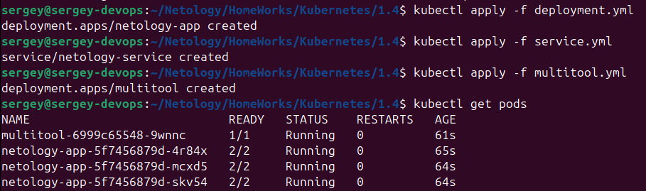
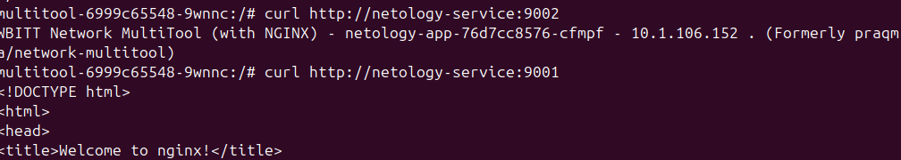
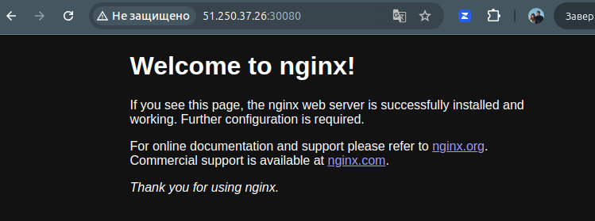
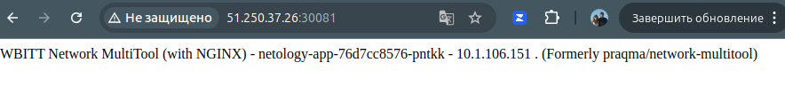

[Задание](https://github.com/netology-code/kuber-homeworks/blob/main/1.4/1.4.md)

```bash
# Копируем скрипты на сервер
export IP=51.250.37.26
scp init.sh admin@$IP:~/
scp prepare.sh admin@$IP:~/
# После запуска скриптов на сервере копируем конфиг
scp admin@$IP:~/microk8s.config ~/.kube/config
```

## Задание 1
1. Создать Deployment приложения, состоящего из двух контейнеров (nginx и multitool), с количеством реплик 3 шт.:

[deployment.yml](deployment.yml)

2. Создать Service, который обеспечит доступ внутри кластера до контейнеров приложения из п.1 по порту 9001 — nginx 80, по 9002 — multitool 8080.

[service.yml](service.yml)

3. Создать отдельный Pod с приложением multitool и убедиться с помощью curl, что из пода есть доступ до приложения из п.1 по разным портам в разные контейнеры.

[multitool.yml](multitool.yml)

4. Продемонстрировать доступ с помощью curl по доменному имени сервиса.






## Задание 2
Создать отдельный Service приложения из Задания 1 с возможностью доступа снаружи кластера к nginx, используя тип NodePort.

[external access](external-service.yml)




