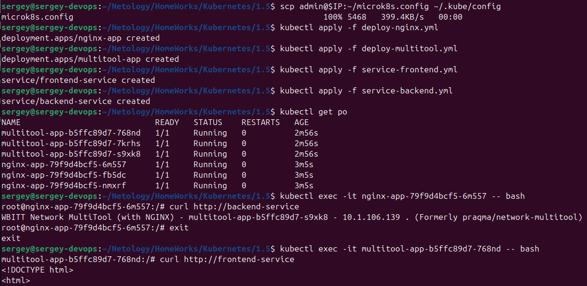
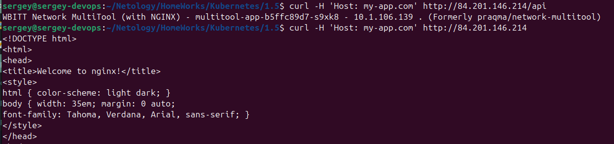

[Задание](https://github.com/netology-code/kuber-homeworks/blob/main/1.5/1.5.md)

## Задание 1. Создать Deployment приложений backend и frontend
1. Создать Deployment приложения frontend из образа nginx с количеством реплик 3 шт.

Пишем [deploy-nginx.yml](deploy-nginx.yml) 

Поднимаем deployment:

`kubectl apply -f deploy-nginx.yml`

2. Создать Deployment приложения backend из образа multitool.
Добавить Service, которые обеспечат доступ к обоим приложениям внутри кластера.

Пишем [deploy-multitool.yml](deploy-multitool.yml)

Поднимаем deployment:

`kubectl apply -f deploy-multitool.yml`

3. Продемонстрировать, что приложения видят друг друга с помощью Service.

Пишем [service-frontend.yml](service-frontend.yml) и [service-backend.yml](service-backend.yml)

Поднимаем:

`kubectl apply -f service-frontend.yml`

`kubectl apply -f service-backend.yml`

Проверяем:

`kubectl exec -it nginx-app-79f9d4bcf5-6m557 -- bash`

`curl http://backend-service`

`kubectl exec -it multitool-app-b5ffc89d7-768nd -- bash`

`curl http://frontend-service`

## Задание 2. Создать Ingress и обеспечить доступ к приложениям снаружи кластера

1. Включить Ingress-controller в MicroK8S.

Запускаем на ноде:

`microk8s enable ingress`

Проверяем локально:

`kubectl get pods -n ingress`

[ingress](images/image02.png)

2. Создать Ingress, обеспечивающий доступ снаружи по IP-адресу кластера MicroK8S так, чтобы при запросе только по адресу открывался frontend а при добавлении /api - backend.

Пишем [ingress.yml](ingress.yml)

Запускаем:

`kubectl apply -f ingress.yml`

3. Продемонстрировать доступ с помощью браузера или curl с локального компьютера.

`curl -H 'Host: my-app.com' http://84.201.146.214/api`

`curl -H 'Host: my-app.com' http://84.201.146.214`

