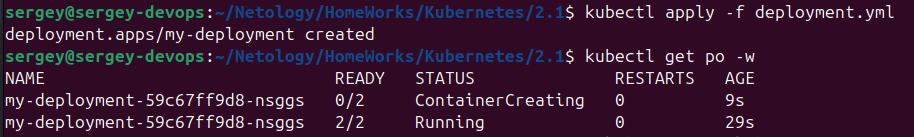

[Задание](https://github.com/netology-code/kuber-homeworks/blob/main/2.1/2.1.md)

## Задание 1: Создать Deployment приложения, состоящего из двух контейнеров и обменивающихся данными.

1. Создать Deployment приложения, состоящего из контейнеров busybox и multitool.

2. Сделать так, чтобы busybox писал каждые пять секунд в некий файл в общей директории.

3. Обеспечить возможность чтения файла контейнером multitool.
Продемонстрировать, что multitool может читать файл, который периодоически обновляется.

Пишем [deployment.yml](deployment.yml)
`kubectl apply -f deployment.yml`
Проверяем:

`kubectl get pods -w`

`kubectl logs my-deployment-59c67ff9d8-nsggs -c multitool`

## Задание 2: Создать DaemonSet приложения, которое может прочитать логи ноды.

1. Создать DaemonSet приложения, состоящего из multitool.
2. Обеспечить возможность чтения файла /var/log/syslog кластера MicroK8S.
3. Продемонстрировать возможность чтения файла изнутри пода.
4. Предоставить манифесты Deployment, а также скриншоты или вывод команды из п. 2.

Пишем [daemonset.yml](daemonset.yml)

Запускаем:

`kubectl apply -f daemonset.yml`

Проверяем статус DaemonSet и запущенных подов:

`kubectl get daemonsets`

Получаем имя пода DaemonSet:
`kubectl get pods -l app=multitool`

Выполним команду `tail` внутри контейнера, чтобы прочитать содержимое файла:

`kubectl exec -it multitool-daemonset-sq7hg -- tail /var/log/syslog`

