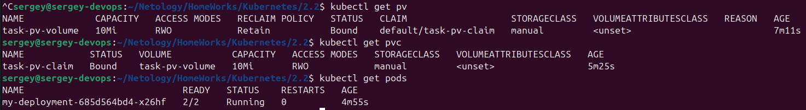
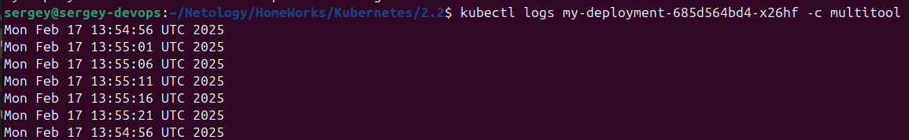
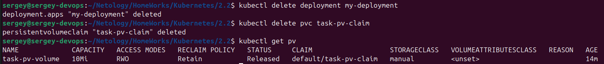
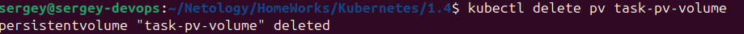
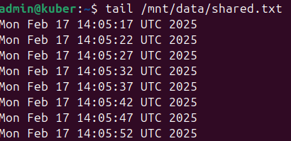
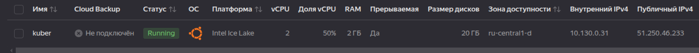
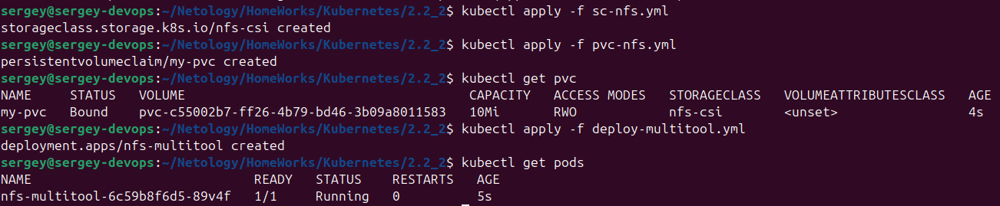
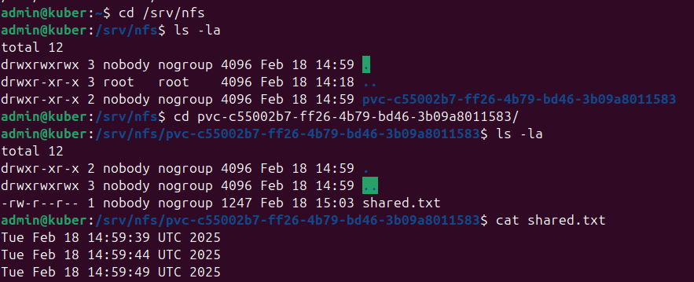
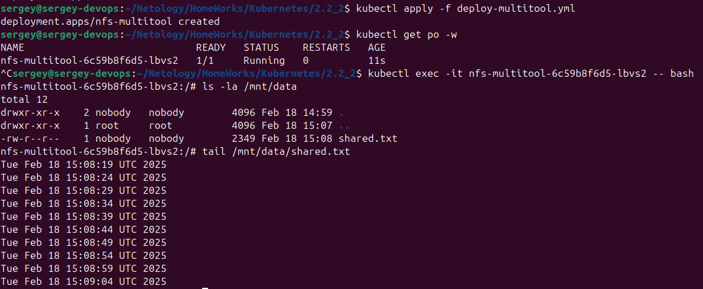

[Задание](https://github.com/netology-code/kuber-homeworks/blob/main/2.2/2.2.md)

## Задание 1 Создать Deployment приложения, использующего локальный PV, созданный вручную.

1. Создать Deployment приложения, состоящего из контейнеров busybox и multitool.

Пишем [deployment](deployment.yml)

2. Создать PV и PVC для подключения папки на локальной ноде, которая будет использована в поде.

Пишем [pv.yml](pv.yml) и [pvc.yml](pvc.yml)

Запускаем:
```bash
kubectl apply -f pv.yml
kubectl apply -f pvc.yaml
kubectl apply -f deployment.yaml
```
Проверяем:



3. Продемонстрировать, что multitool может читать файл, в который busybox пишет каждые пять секунд в общей директории.

`kubectl logs my-deployment-685d564bd4-x26hf -c multitool`


4. Удалить Deployment и PVC. Продемонстрировать, что после этого произошло с PV. Пояснить, почему.

```bash
kubectl delete deployment my-deployment
kubectl delete pvc task-pv-claim
```



После удаления PVC, PersistentVolume перешёл в состояние Released. Это означает, что PV больше не связан с PVC, но данные на диске остаются.

5. Продемонстрировать, что файл сохранился на локальном диске ноды. Удалить PV. Продемонстрировать что произошло с файлом после удаления PV. Пояснить, почему.

`kubectl delete pv task-pv-volume`



Файл сохранился:



## Задание 2 Создать Deployment приложения, которое может хранить файлы на NFS с динамическим созданием PV.

1. Включить и настроить NFS-сервер на MicroK8S.

Следуем инструкции:  
`https://microk8s.io/docs/how-to-nfs`

В `/etc/exports` пишем сеть внутреннего IP, выданного Yandex Cloud:
```
/srv/nfs 10.131.0.0/24(rw,sync,no_subtree_check)
```


Модифицируем пример [`sc-nfs.yml`](sc-nfs.yml), прописывая внутренний IP от Yandex Cloud.

Модифицируем пример [`pvc-nfs.yml`](pvc-nfs.yml), изменяем размер.

Применяем:  
```bash
kubectl apply -f sc-nfs.yml
kubectl apply -f pvc-nfs.yml
```

Проверяем как создался pv и pvc:  
```bash
kubectl get pv
kubectl get pvc
```


2. Создать Deployment приложения состоящего из multitool, и подключить к нему PV, созданный автоматически на сервере NFS.

Пишем [deploy-multitool](deploy-multitool.yml)

Применяем:  
`kubectl apply -f deploy-multitool.yml`

Смотрим поды:  
`kubectl get pods`  


3. Продемонстрировать возможность чтения и записи файла изнутри пода.

Смотрим файл на сервере:


Читаем тот же файл изнутри пода:  
`kubectl exec -it <pod_name> -- bash`  

