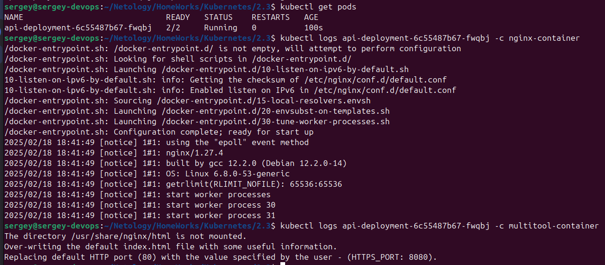
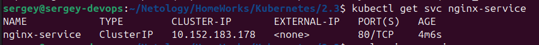
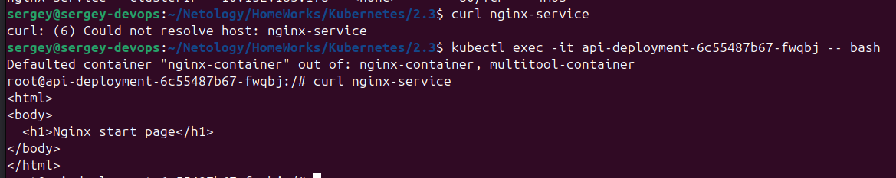
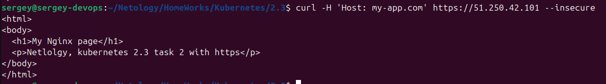

[Здаание](https://github.com/netology-code/kuber-homeworks/blob/main/2.3/2.3.md)

## Задание 1 Создать Deployment приложения и решить возникшую проблему с помощью ConfigMap. Добавить веб-страницу

Пишем [`nginx-multitool.yaml`](nginx-multitool.yaml)

Запускаем:  
`kubectl apply -f nginx-multitool.yaml`  

Проверяем поды:  
`kubectl get pods -w`

Проверяем логи nginx и multitool:  
`kubectl logs <pod-name> -c nginx-container`  
`kubectl logs <pod-name> -c multitool-container`  


Проверяем доступность Nginx через Service:

```bash
kubectl get svc nginx-service
kubectl exec -it api-deployment-6c55487b67-fwqbj -- bash
curl nginx-service
```




## Задание 2 Создать приложение с вашей веб-страницей, доступной по HTTPS

На сервере добавляем `ingress`:  
`microk8s enable ingress`

Создаём сертификат:
```bash
openssl req -x509 -nodes -days 365 -newkey rsa:2048 -keyout tls.key -out tls.crt -subj "/CN=my-app.com"
```

Содаём манифест [`deploy-nginx.yaml`](deploy-nginx.yaml)

Создаём Secret:

```bash
kubectl create secret tls nginx-tls --key tls.key --cert tls.crt
```

Создаём подготовленные сущности:  
```bash
kubectl apply -f deploy-nginx.yaml
```

`curl -H 'Host: my-app.com' https://51.250.42.101 --insecure`


