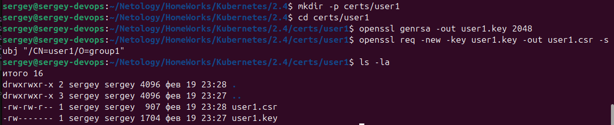
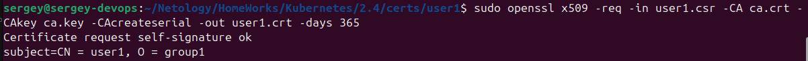
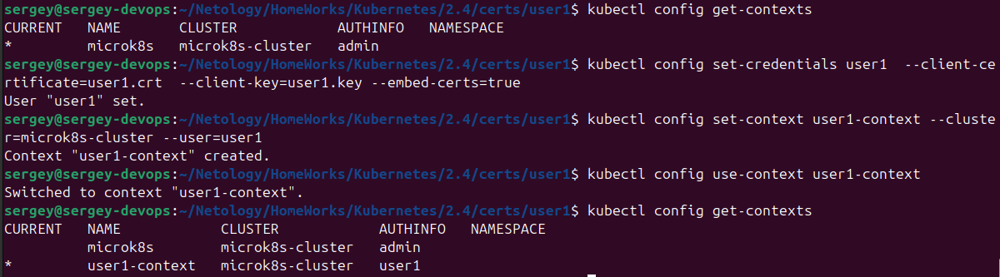
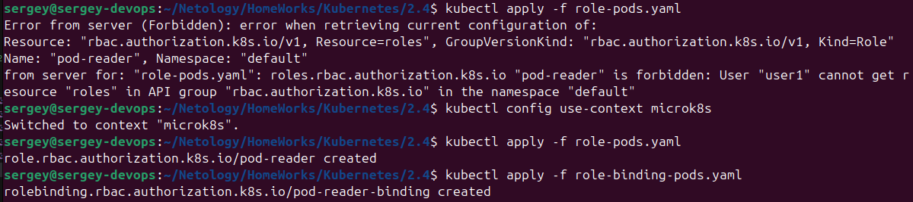
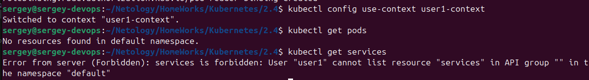

[Задание](https://github.com/netology-code/kuber-homeworks/blob/main/2.4/2.4.md)

## Задание 1. Создайте конфигурацию для подключения пользователя
1. Создайте и подпишите SSL-сертификат для подключения к кластеру.
2. Настройте конфигурационный файл kubectl для подключения.
3. Создайте роли и все необходимые настройки для пользователя.
4. Предусмотрите права пользователя. Пользователь может просматривать логи подов и их конфигурацию (kubectl logs pod <pod_id>, kubectl describe pod <pod_id>).
5. Предоставьте манифесты и скриншоты и/или вывод необходимых команд.

Для установки и базовой настройки выполняем заранее подготовленные [init.sh](../prepare/init.sh) и [prepare.sh](../prepare/prepare.sh).

Сразу подключаем RBAC:  
`microk8s enable rbac`

Для создания нового сертификата выполняем локально:
```bash
mkdir -p certs/user1
cd certs/user1
# Генерируем ключ
openssl genrsa -out user1.key 2048
# Генерируем сертификат с использованием этого ключа
openssl req -new -key user1.key -out user1.csr -subj "/CN=user1/O=group1"
```


Копируем ключ и сертификат из кластера:
```bash
scp admin@$IP:/var/snap/microk8s/current/certs/ca.crt .
scp admin@$IP:/var/snap/microk8s/current/certs/ca.key .
```

Подписываем сертификат, используя CA кластера:

```bash
sudo openssl x509 -req -in user1.csr -CA ca.crt -CAkey ca.key -CAcreateserial -out user1.crt -days 365
```


Создаём конфигурационный файла для пользователя user1:

```bash
kubectl config set-credentials user1  --client-certificate=user1.crt  --client-key=user1.key --embed-certs=true

kubectl config set-context user1-context --cluster=microk8s-cluster --user=user1

kubectl config use-context user1-context
```


Создаём [role-pods.yaml](role-pods.yaml)

Создаём [role-binding-pods.yaml](role-binding-pods.yaml)

От имени администратора (KUBECONFIG=~/.kube/config) применяем роль (локально):  
`kubectl apply -f role-pods.yaml`  
`kubectl apply -f role-binding-pods.yaml`  



Здесь видно, что из нового контекста нельзя создать роль. Для этого нужно обратно переключить контекст `kubectl config use-context microk8s`

Обратно переключаем контекст `kubectl config use-context user1-context`  

Проверяем:  


Видим, что `kubectl get pods` сработал, а для `kubectl get services` доступ роли закрыт.
