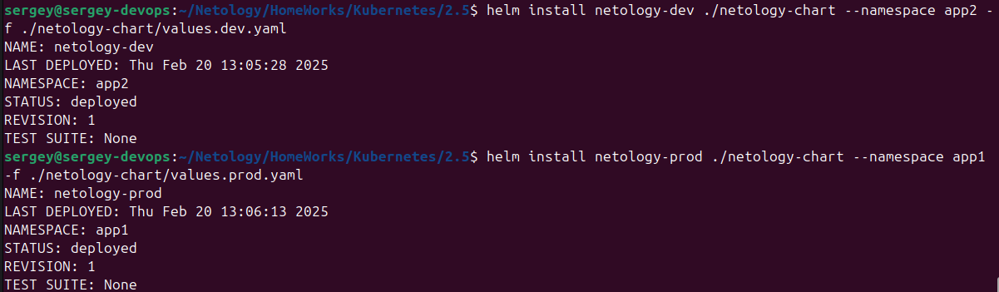

[Задание](https://github.com/netology-code/kuber-homeworks/blob/main/2.5/2.5.md)

## Задание 1. Подготовить Helm-чарт для приложения
1. Необходимо упаковать приложение в чарт для деплоя в разные окружения.
2. Каждый компонент приложения деплоится отдельным deployment’ом или statefulset’ом.
3. В переменных чарта измените образ приложения для изменения версии.

Создаём новый chart:
`helm create netology-chart`

Создаём файлы [`frontend-deployment.yaml`](netology-chart//templates/frontend-deployment.yaml), [`backend-deployment.yaml`](netology-chart/templates/backend-deployment.yaml), [`values.yaml`](netology-chart/values.yaml).

Для разных окружений создаём [`values.dev.yaml`](netology-chart/values.dev.yaml) и [`values.prod.yaml`](netology-chart/values.prod.yaml).


Запускаем chart:
`helm install netology-app ./netology-chart -f ./netology-chart/values.dev.yaml`


Меняем версию, например, multitool в `values.dev.yaml`:
```yaml
frontend:
  replicaCount: 1
backend:
  replicaCount: 1
  image:
    tag: latest
```

Запускаем upgrade:  
`helm upgrade netology-app ./netology-chart -f ./netology-chart/values.dev.yaml`


Пробуем rollback:  
`helm rollback netology-app`  


## Задание 2. Запустить две версии в разных неймспейсах
Подготовив чарт, необходимо его проверить. Запуститe несколько копий приложения.
Одну версию в namespace=app1, вторую версию в том же неймспейсе, третью версию в namespace=app2.
Продемонстрируйте результат.

Создаём 2 namespaces:
```bash
kubectl create namespace app1
kubectl create namespace app2
```

Запускаем prod в namespace app1
`helm install netology-prod ./netology-chart --namespace app1 -f ./netology-chart/values.prod.yaml`

Запускаем dev в namespace app2:
`helm install netology-dev ./netology-chart --namespace app2 -f ./netology-chart/values.dev.yaml`



Проверяем поды в `app1` и `app2`:
```bash
kubectl get pods -n app1
kubectl get pods -n app2
```


В namespace app1 больше подов, т.к. там по 3 реплики ([values.prod.yaml](netology-chart/values.prod.yaml))

Добавляем версию dev namespace app1:
`helm install netology-dev ./netology-chart --namespace app1 -f ./netology-chart/values.dev.yaml`

Проверяем, должно быть 8 подов (2 dev и 6 prod):

