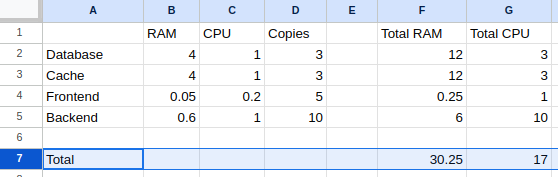
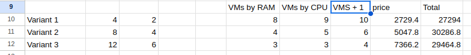
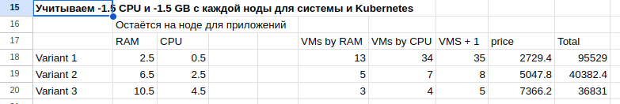

[Задание](https://github.com/netology-code/kuber-homeworks/blob/main/3.1/3.1.md)

- Вычисляем общее количество необходимых ресурсов для приложений (используем [Google Steets](https://docs.google.com/spreadsheets/d/1in-TisepRSLQXzKPC3wIHDskPav20-y5naCQAQL-O_Y/edit?usp=sharing))

- Предварительно рассчитываем варианты ВМ учитывая только потребление приложений + 1 дополнительная нода для отказоустойчивости.

- Учитываем ресурсы для компонентов Kubernetes
ОЗУ: 1 ГБ на ноду.
CPU: 1 CPU на ноду.

Также нужно учитывать, что на каждой ноде будет работать системные демоны (например, sshd, logging, monitoring и т.д.), которые тоже потребляют ресурсы.
ОЗУ: 0.5 ГБ на ноду
CPU: 0.5 CPU на ноду

Здесь картина с ценами сильно поменялась, выгоднее заказывать меньше нод с большими ресурсами.

Поэтому на начальном этапе будет целесообразно выделить 5 нод с 12 GB памяти и 6 ядрами процессора.
