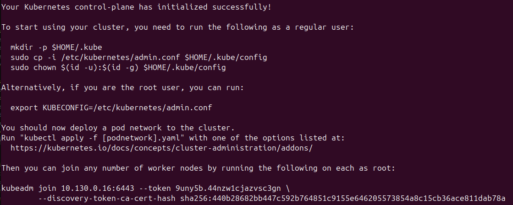
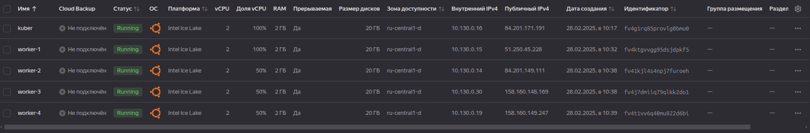

[Задание](https://github.com/netology-code/kuber-homeworks/blob/main/3.2/3.2.md)

## Задание 1. Установить кластер k8s с 1 master node
- Подготовка работы кластера из 5 нод: 1 мастер и 4 рабочие ноды.
- В качестве CRI — containerd.
- Запуск etcd производить на мастере.
- Способ установки выбрать самостоятельно.

### Способ установки - kubeadm.

Идём на официальную [`документацию`](https://kubernetes.io/docs/setup/production-environment/tools/kubeadm/install-kubeadm/).

- Подготавливаем для установки  
```bash
sudo apt-get update
sudo apt-get install -y apt-transport-https ca-certificates curl gpg
```
- Загружаем публичный ключ подписи для репозиториев пакетов Kubernetes.
```bash
# If the directory `/etc/apt/keyrings` does not exist, it should be created before the curl command, read the note below.
# sudo mkdir -p -m 755 /etc/apt/keyrings
curl -fsSL https://pkgs.k8s.io/core:/stable:/v1.32/deb/Release.key | sudo gpg --dearmor -o /etc/apt/keyrings/kubernetes-apt-keyring.gpg

```
- Добавляем соответствующий aptрепозиторий Kubernetes.
```bash
echo 'deb [signed-by=/etc/apt/keyrings/kubernetes-apt-keyring.gpg] https://pkgs.k8s.io/core:/stable:/v1.32/deb/ /' | sudo tee /etc/apt/sources.list.d/kubernetes.list

```

- Обновляем `apt` индекс пакетов, устанавливаем `kubelet`, `kubeadm`, `kubectl` и `contgainerd`
```bash
sudo apt-get update
sudo apt-get install -y kubelet kubeadm kubectl containerd
```
- Закрепляем версии
```bash
sudo apt-mark hold kubelet kubeadm kubectl
```
- Включаем службу `kubelet` перед запуском `kubeadm`:
```bash
sudo systemctl enable --now kubelet
```
- Инициализируем кластер, прописывая наши значения:
```bash
sudo kubeadm init \
--apiserver-advertise-address=10.130.0.16 \
--pod-network-cidr 10.244.0.0/16 \
--apiserver-cert-extra-sans=84.201.171.191
```

- При сбое запустить одной командой:
```bash
cat <<EOF | sudo tee /etc/modules-load.d/k8s.conf
overlay
br_netfilter
EOF

sudo modprobe overlay
sudo modprobe br_netfilter

cat <<EOF | sudo tee /etc/sysctl.d/k8s.conf
net.bridge.bridge-nf-call-iptables = 1
net.bridge.bridge-nf-call-ip6tables = 1
net.ipv4.ip_forward = 1
EOF

sudo sysctl --system

```



В результате получили команду для присоединения нового элемента к нашему кластеру:
```bash
sudo kubeadm join 10.130.0.19:6443 --token vc12wj.l7qpa3zjr167pnk1 \
	--discovery-token-ca-cert-hash sha256:198df0ce7750f8ff2cd319fe301cf8b4da17f85918b596529415c992941f5800

```

### Настраиваем kubectl для текущего пользователя:
```bash
mkdir -p $HOME/.kube
sudo cp -i /etc/kubernetes/admin.conf $HOME/.kube/config
sudo chown $(id -u):$(id -g) $HOME/.kube/config
```

### Устанавливаем сетевой плагин
```bash
kubectl apply -f https://raw.githubusercontent.com/coreos/flannel/master/Documentation/kube-flannel.yml
```


### Подключаем новые ноды
Создаём новые виртуальные машины для worker.


На каждой запускаем шаги для установки из [steps_kubeadm.md](steps_kubeadm.md)

На каждой ноде выполняем  kubeadm join, который получили при установке мастер ноды

Проверяем подключенные ноды:  


